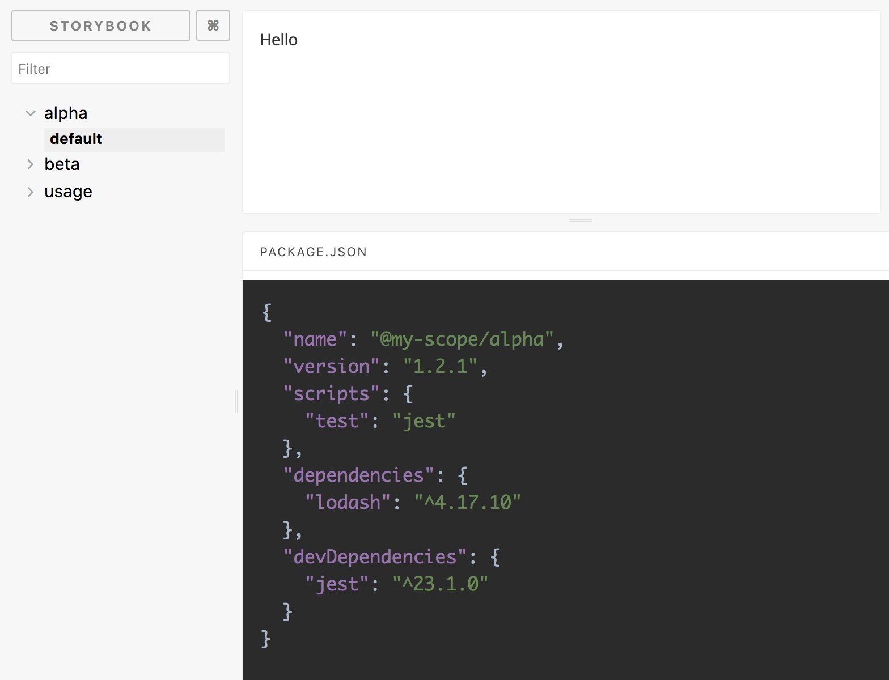
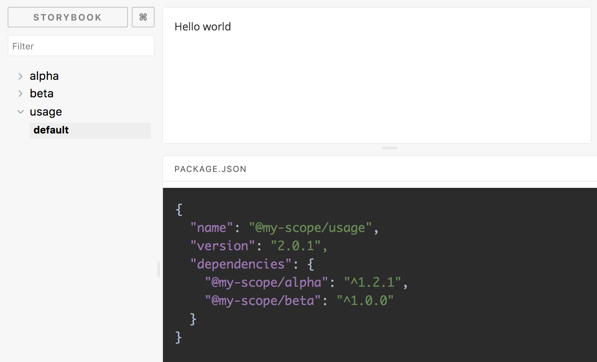

# Storybook package.json Addon

[![npm version][1]][2]

Display the closest `package.json` file to the story. Mainly useful when you use storybook with lerna.

Let's consider this example

```sh
.
├── .storybook
├── lerna.json
├── package.json
└── packages
    ├── alpha
    │   ├── index.js
    │   ├── alpha.stories.js
    │   └── package.json
    ├── beta
    │   ├── index.js
    │   ├── beta.stories.js
    │   └── package.json
    └── usage
        ├── index.js
        ├── usage.stories.js
        └── package.json
```

With this `storybook-addon-package-json` stories will have a tab containing their `package.json`





## Installation and usage

First, install the addon

```sh
npm install -D storybook-addon-package-json
```

Add this line to your `addons.js` file

```js
import "storybook-addon-package-json/register";
```

### a) as a webpack loader

Use this hook to a custom webpack.config. This will generate a decorator call in every story and automatically search for `package.json`:

```js
module.exports = {
  module: {
    rules: [
      {
        test: /\.stories\.jsx?$/,
        use: [
          {
            loader: require.resolve("storybook-addon-package-json/loader")
          }
        ]
      }
    ]
  }
};
```

### b) as a decorator in story

It is possible to inject custom `package.json` to story without configuring `storybook-addon-package-json/loader`:

```js
import React from "react";
import { storiesOf } from "@storybook/react";
import withPackageJson from "storybook-addon-package-json";
import packageJson from "./package.json";

const stories = storiesOf("Example", module).addDecorator(
  withPackageJson(packageJson)
);
stories.add("default", () => <div>story example</div>);
```

You can always use custom decorator and loader - when both are used `package.json` from decorator will be used.

## Usage with `@storybook/addon-storysource`

Since this package modifies original story source code, you should to use `@storybook/addon-storysource/loader` before `storybook-addon-package-json/loader`:

```js
module.exports = {
  module: {
    rules: [
      {
        test: /\.stories\.jsx?$/,
        use: [
          {
            loader: require.resolve("storybook-addon-package-json/loader")
          },
          {
            loader: require.resolve("@storybook/addon-storysource/loader")
          }
        ]
      }
    ]
  }
};
```

[1]: https://img.shields.io/npm/v/storybook-addon-package-json.svg?style=flat-square
[2]: https://npmjs.org/package/storybook-addon-package-json
